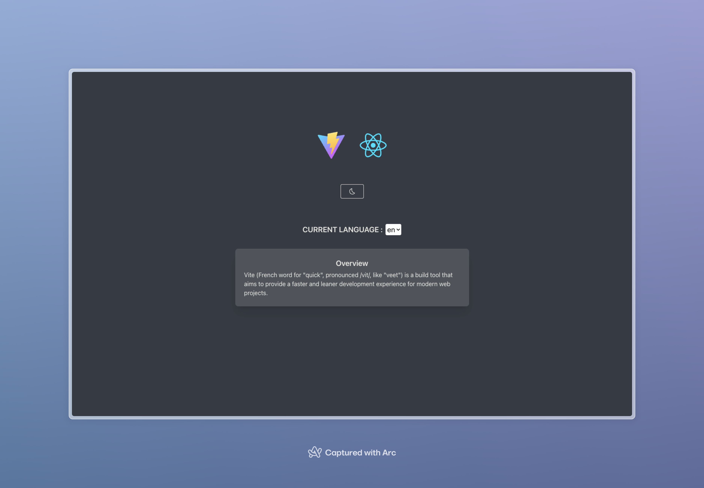

# Vite + React18 + Typescript + UnoCSS

<div align="center">
    <a href="#">
        
    </a>
</div>

## Usage

```
pnpm install
pnpm dev
```

## ♈️ Icon

- icon by [icontify/icon](https://icon-sets.iconify.design/)
- use with [unocss Icons preset](https://unocss.dev/presets/icons) Example

```
<div class="i-mdi-alarm text-orange-400" />
```

## 🎨 Style

- UnoCSS
- Dark/light Mode toggle

## VScode setting

- `unocss`,`i18n-ally`

## Internationalization

- framework with `i18n` `react-i18n`
- language file: `src/public/locales`
