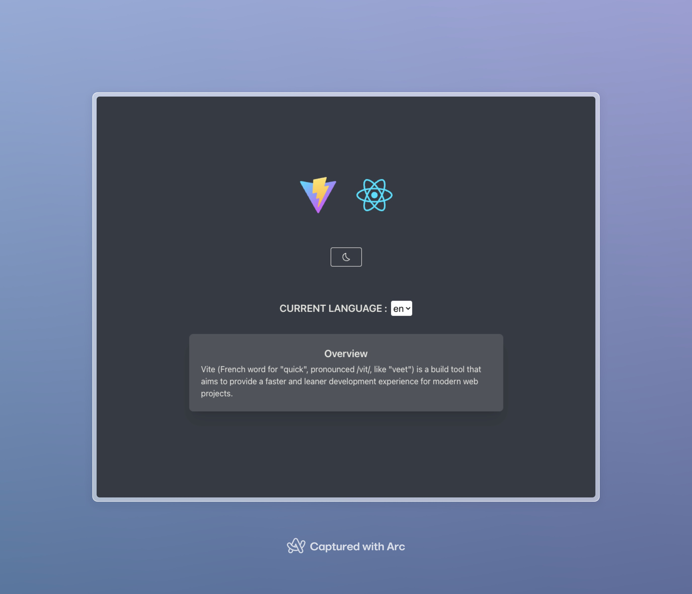

# Vite + React18 + Typescript + UnoCSS

<div align="center">
    <a href="#">
        
    </a>
</div>

<div align="center">
    <a href="https://github.com/Fizzbow/vite-template-react-unocss">github</a>
</div>

## 🔧 Usage

```
pnpm install
pnpm dev
```

## 📝 VSCode plugins

- setting file in

  ```
  root
  ---|_.vscode
  -----|_extensions.json
  ```

  displayed on the vscode like:
  

## ♈️ Icon

- icon by [icontify/icon](https://icon-sets.iconify.design/)
- with [unocss Icons preset](https://unocss.dev/presets/icons) Example

```
<div class="i-mdi-alarm text-orange-400" />
```

## 🎨 Style

### [UnoCSS](https://unocss.dev/)

- config in uno.config.ts
- Responsive style adjustments:

  ```
    <div sx="w-full" sm="w-[900px]"/>

    ---------equal-----------

    @media (min-width: 320px)
    .xs\:w-full {
        width: 100%;
    }

    @media (min-width: 640px)
    .sm\:w-full {
        width: 900px;
    }

  ```

## 🌍 Internationalization

- framework with `i18n` `react-i18n`
- language file: `src/public/locales`

## 🚗 UI Components

| UI framework with [Material UI v5](https://mui.com/material-ui/all-components/)

### usage

- theme color setting

```
root
  ---|_src
  -----|_theme.tsx
```

- primary is Default color

```
const theme = createTheme({
  palette: {
    primary: {
      main: "#6641CF",
    },
  },
});
```
